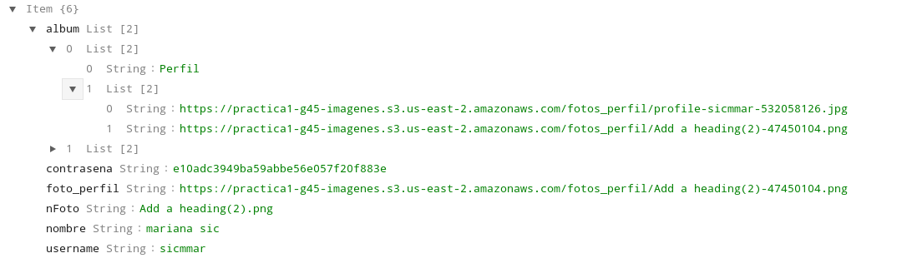
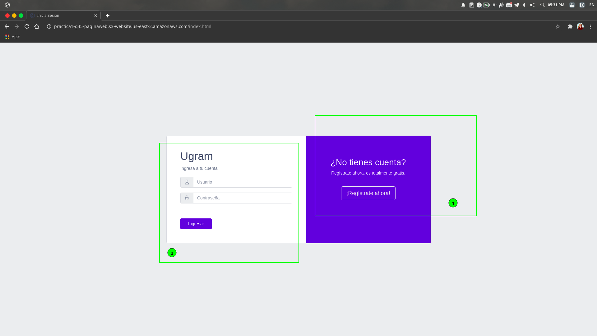
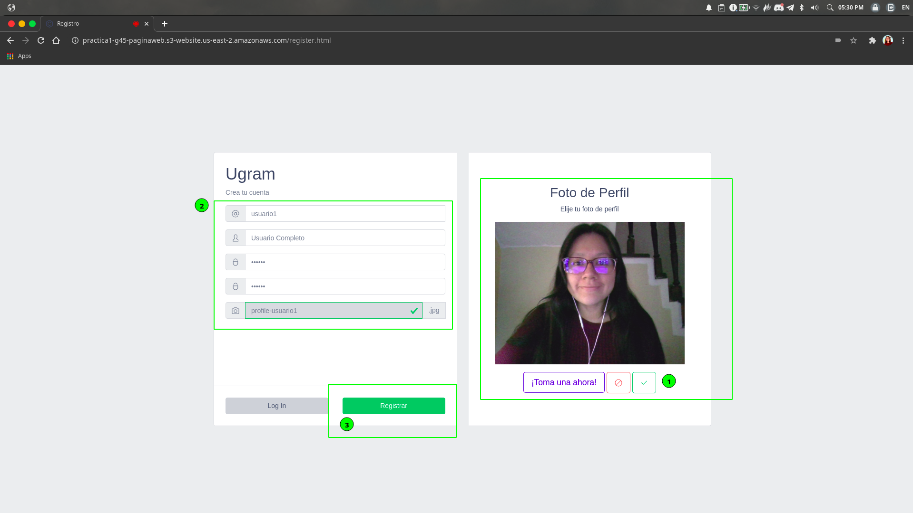
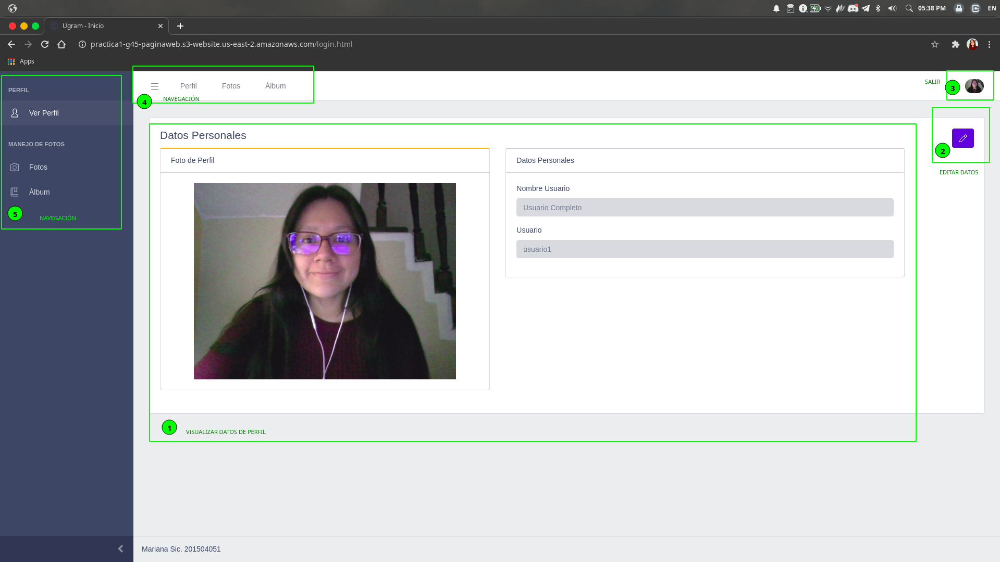
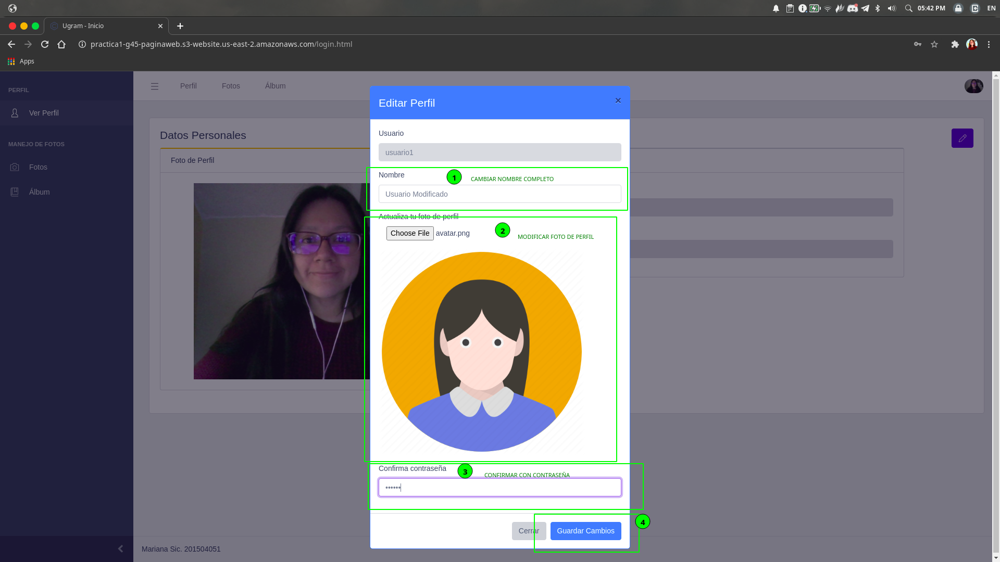
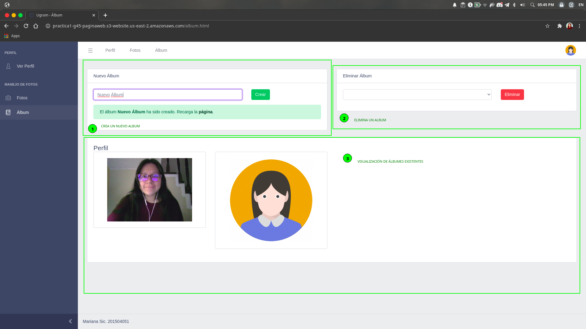
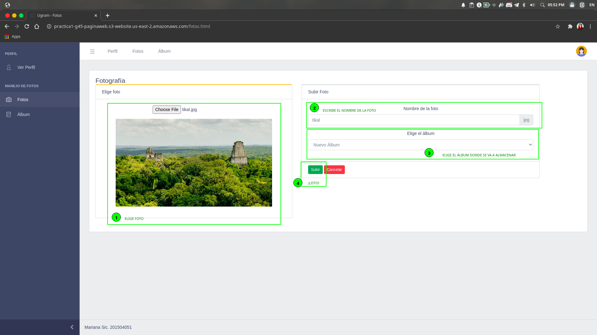
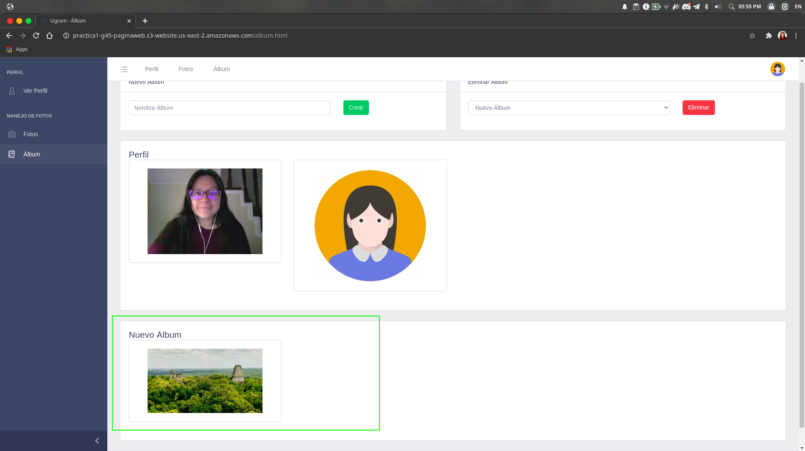

# Práctica 1 - Seminario de Sistemas 1
-----
Grupo #45

- Integrantes

|Nombre|Carnet|
|--|--|
| Asunción Mariana Sic Sor | 201504051|
| Elba María Alvarez Domínguez | 201408549 |
 <div style="text-align: justify">
 
## **UGRAM** 
Se desarrolló una aplicación web similar a un aplicación para almacenamiento de fotos, esta permite subir todo tipo de fotos. 

## Arquitectura
* ### Aplicación Web
    Aplicación creada con Bootstrap, Javascript, CSS y HTML
* ### Load Balancer
    AWS Load Balancing es el balanceador de carga utilizado en esta aplicación, encargado de distribuir o redirigir la carga de stráfico de peticiones dentro de dos servidores, uno creado con Python y otro creado con NodeJs, en caso llegase a ocurrir una desconexión repentina de uno de los servidores.
* ### Servidor Python
    Para el desarrollo de este servidor, se hizo uso de Flask para poder crear la respectica API RESTFul, así como librerías en la integración de toda la práctica: flask_cors, boto3
* ### Servidor NodeJs
    Entorno de ejecución multiplataforma de instalado con los paquetes de express, cors, nodemon y AWS-sdk.
* ### Bucket de Imágenes
    Se utilizó AWS S3 para el alojamiento de las imágenes tanto las de perfil como la de los diferentes álbumes, así como para alojar la página web.
* ### Base de Datos
    Para la base de datos de este proyecto se utilizó el servicio de DynamoDB (NoSQL)

## Usuarios IAM
Se crearon usuarios por cada uno de los servicios de AWS utilizados en la arquitectura de la aplicación, usuarios para administrar: 
* #### S3
    Vista desde consola de administrador

    

    Vista desde consola de usuario ``` s3-sicmmar ```

    

    Políticas para grupo ```s3-group``` al cual pertenece ``` s3-sicmmar ```

    


* #### EC2 
    Vista desde consola de administrador

    

    Vista desde consola de usuario ``` ec2-sicmmar ```

    

* #### DynamoDB
    Vista desde consola de administrador

    

    Vista desde consola de usuario ```dynamo-sicmmar``` 

## Capturas de Pantalla de Elementos para Ugram
* ### Buckets de S3 
    Bucket ``` practica1-g45-imagenes ```, este contiene dos carpetas (```fotos_perfil``` y ```fotos_publicadas```) en las cuáles se almacenan todas las imágenes a almacenar en Ugram.

    

    Bucket ``` practica1-g45-paginaweb ```, este contiene alojado el sitio web estático para la visualización de Ugram.

    

* ### EC2
* ### Tablas de DynamoDB
    Para el almacenamiento de los datos de Ugram, se utilizó una tabla llamada ```usuario```, la cual cada registro en ella contiene la siguiente estructua

    ``` json
    {
        "username":"usuario1",
        "nombre":"Nombre Usuario",
        "nFoto":"perfil.png",
        "foto_perfil":"https://url-bucket-img/perfil-47450104.png",
        "contrasena":"contrasenaenMD5",
        "album": [
            [
                "nombre_album":"Perfil",
                [
                    Lista de Fotos
                    ...
                ]
            ],
            
            Lista de Albumes
            ...   
        ]
    }
    ```

    Por ejemplo, se puede observar la estructura anterior en un registro para el usuario ```sicmmar```

    

* ### Aplicación Web
    [Página de Inicio](http://practica1-g45-paginaweb.s3-website.us-east-2.amazonaws.com/)

    

    Página de Registro

    

    Página principal donde el usuario puede observar y gestionar sus datos

    

    Editar datos de perfil

    

    Manejo de Álbum / Visualización de Fotos

    

    Cargar una nueva foto

    

    