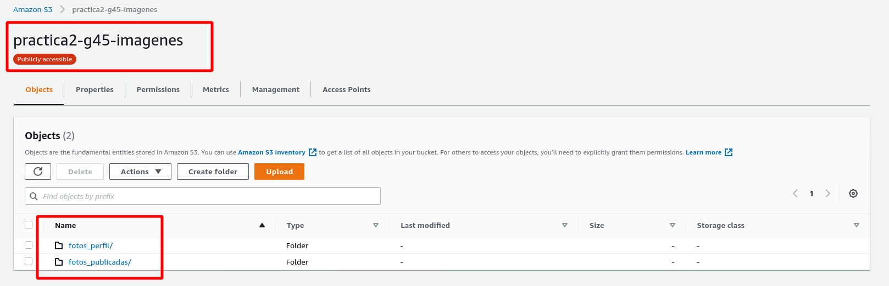
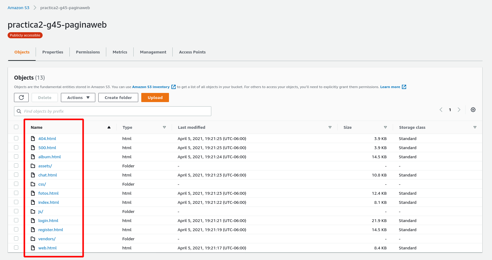
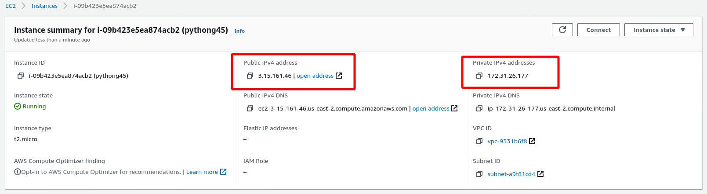
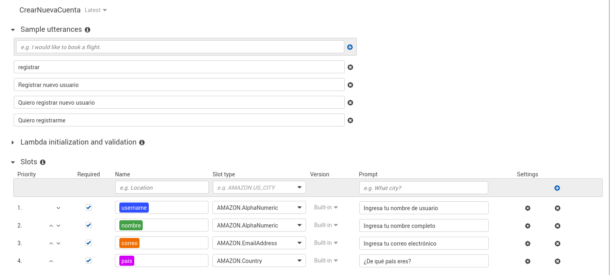
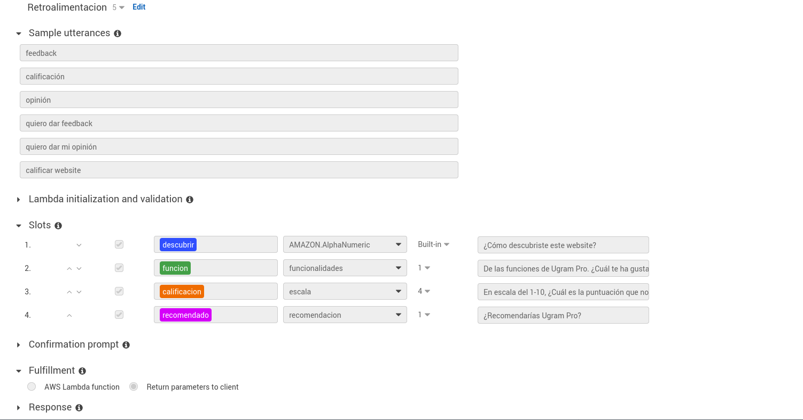
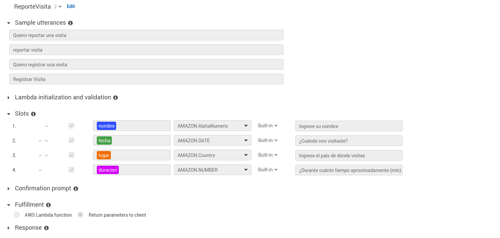

# Práctica 2 - Seminario de Sistemas 1
-----
Grupo #45

- Integrantes

|Nombre|Carnet|
|--|--|
| Asunción Mariana Sic Sor | 201504051|
| Elba María Alvarez Domínguez | 201408549 |
 <div style="text-align: justify">

Tabla de Contenido
---
* [UGRAM PRO](#ugram-pro)
    * [Arquitectura](#arquitectura)
        * [Aplicación Web](#aplicación-web)
        * [Servidor Python](#servidor-python)
        * [Bucket de imágenes](#bucket-de-imágenes)
        * [Base de Datos](#base-de-datos)
        * [Machine Learning](#machine-learning)
        * [Traductor](traductor)
        * [Diagrama de Arquitectura](#diagrama)
    * [Usuarios en IAM](#usuarios-iam)
        * [Máquina virtual de EC2](#ec2)
        * [Buckets en S3](#s3)
        * [Base de datos DynamoDB](#dynamodb)
        * [Rekognition](#rekognition)
        * [Amazon Translate](#translate)
        * [Amazon Lex: Para ChatBot](#lex)
    * [Elementos de Ugram Pro](#elementos-de-ugram-pro)
        * [Buckets de S3](#buckets-de-s3)
        * [Máquina Virtual EC2](#máquina-virtual-ec2)
        * [Tablas de DynamoDB](#tablas-de-dynamodb)
    * [Imágenes de la Aplicación Web](#aplicación-web)


## **UGRAM PRO** 
Se desarrolló una aplicación web similar a un aplicación para almacenamiento de fotos, esta permite subir todo tipo de fotos. Utilizar servicios de Machine Learning.

## Arquitectura
* ### Aplicación Web
    Aplicación creada con Bootstrap, Javascript, CSS y HTML
* ### Servidor Python
    Para el desarrollo de este servidor, se hizo uso de Flask para poder crear la respectica API RESTFul, así como librerías en la integración de toda la práctica: flask_cors, boto3
* ### Bucket de Imágenes
    Se utilizó AWS S3 para el alojamiento de las imágenes tanto las de perfil como la de los diferentes álbumes, así como para alojar la página web.
* ### Base de Datos
    Para la base de datos de este proyecto se utilizó el servicio de DynamoDB (NoSQL)
* ### Machine Learning
    Se han agregado funciones como reconocimiento facial, características que posee una persona en su foto de perfil y los álbumes de han categorizado según las fotos que se deseen subir.
* ### Traductor
    La descripción de cada fotografía tiene la opción de traducir a tres diferentes idiomas. Estos son: Inglés, Ruso y Portugués. El idioma de origen puede ser cualquiera.
* ### Diagrama


## Usuarios IAM
Se crearon usuarios por cada uno de los servicios de AWS utilizados en la arquitectura de la aplicación, usuarios para administrar: 
* ### S3
    Vista desde consola de administrador

    

    Vista desde consola de usuario ``` s3-sicmmar ```

    

    Políticas para grupo ```s3-group``` al cual pertenece ``` s3-sicmmar ```

    


* ### EC2 
    Vista desde consola de administrador

    

    Vista desde consola de usuario ``` ec2-sicmmar ```

    

* ### DynamoDB
    Vista desde consola de administrador

    

    Vista desde consola de usuario ```dynamo-sicmmar``` 

* ### Rekognition
    Vista desde consola de administrador

    

* ### Translate
    Vista desde consola de administrador

    

* ### Lex
    Vista desde consola de administrador

    

## Elementos para Ugram Pro
* ### Buckets de S3 
    Bucket ``` practica2-g45-imagenes ```, este contiene dos carpetas (```fotos_perfil``` y ```fotos_publicadas```) en las cuáles se almacenan todas las imágenes a almacenar en Ugram.

    

    Bucket ``` practica2-g45-paginaweb ```, este contiene alojado el sitio web estático para la visualización de Ugram.

    

* ### Máquina Virtual EC2

    Máquina Virtual con Ubuntu para servidor de Python con IP privada de ```172.31.26.177``` e IP pública ```3.15.161.46```.

    
    

* ### Tablas de DynamoDB
    Para el almacenamiento de los datos de Ugram, se utilizó una tabla llamada ```usuario```, la cual cada registro en ella contiene la siguiente estructua

    ``` json
    {
        "username":"usuario1",
        "nombre":"Nombre Usuario",
        "nFoto":"perfil.png",
        "foto_perfil":"https://url-bucket-img/perfil-47450104.png",
        "contrasena":"contrasenaenMD5",
        "etiquetas": [
            {
                "edad":"21-35 años"
            },
            {

                "barba":"No tiene barba"
            },
            {

                "lentes" :"Usa lentes"
            },
            {

                "ojos":"Ojos Abiertos"
            },
            {

                "genero":"Femenino"
            },
            {

                "sonrisa":"No esta sonriendo"
            },
            {

                "sentimiento":"Feliz"
            }
        ],
        "album": [
            [
                {
                    "nombre_album":"Perfil",
                    [
                        Lista de Fotos
                        ...
                    ]
                },
                {
                    "nombre_album":"Album1",
                    [
                        {
                            "nombre_foto":"Foto1",
                            "descripcion":"Descripcion Foto 1",
                            "enlace_foto":"http://practica2-g45-paginaweb.s3-website.us-east-2.amazonaws.com/fotos_publicadas/foto1-4778914.jpg"
                        },
                        Lista de Foto de cualquier Album
                        ...
                    ]
                }
            ],
            
            Lista de Albumes
            ...   
        ]
    }
    ```

    Por ejemplo, se puede observar la estructura anterior en un registro para el usuario ```sicmmar```

    

* ### ChatBot en Amazon Lex

<table>
<tr style="text-align:center;">
    <td>Función</td>
    <td>Descripción</td>
    <td></td>
</tr>
<tr>
<td style="text-align:center;">

```python
CrearNuevaCuenta
```
</td>
<td style="text-align:center;">
Con esta funcionalidad el usuario logra registrarse en el sistema de ugram Pro gracias a la asistencia guiada del chatbot
</td>
<td style="text-align:center;"></td>
</tr>
<tr>
<td style="text-align:center;">

```python
Retroalimentacion
```
</td>
<td style="text-align:center;">
El chatbot captura la opinion del usuario respecto a UgramPro extrayendo informacion solicitada en una serie de preguntas automatizadas.
</td>
<td style="text-align:center;"></td>
</tr>
<tr>
<td style="text-align:center;">

```python
ReporteVisita
```
</td>
<td style="text-align:center;">
El usuario puede registrar en el sistema de UgramPro una visita realizada al website, para esto el chatbothará una serie de preguntas de las cuales se generará dicho reporte.
</td>
<td style="text-align:center;"></td>
</tr>
</table>

* ### Funciones de Amazon Rekognition
Estas funciones están descritas para el SDK de AWS para Python ([boto3](https://boto3.amazonaws.com/v1/documentation/api/latest/index.html))
<table>
<tr style="text-align:center;">
    <td>Método</td>
    <td>Parámetro</td>
    <td>Descripción</td>
</tr>
<tr>
<td style="text-align:center;">

```python
compare_faces()
```
</td>
<td>

  ```python
SourceImage={
    'S3Object':{
        'Bucket':BUCKET_NAME,
        'Name': nombre_foto
    }
}, 
TargetImage={
    'Bytes':base64.b64decode(imagen)
},
SimilarityThreshold=81
  ```
</td>
<td style="text-align:center;">Método utilizado para comparar similitud de dos rostros entre dos imágenes dadas con un número dado de aprobación de similitud. Para este caso, la imagen origen será la foto de perfil publicada en un bucket de S3 y la imagen destino será la imagen que sea tomada en el instante con cámara web y enviada en base64</td>
</tr>
<tr>
<td style="text-align:center;">

```python
detect_faces()
```
</td>
<td>

  ```python
Image={
    'S3Object':{
        'Bucket':BUCKET_NAME,
        'Name': ubicacion
    }
},
Attributes=['ALL']
  ```
</td>
<td style="text-align:center;">Método utilizado para detectar rostros en una imagen dada, la imágen de origen será la foto de perfil del usuario publicada en un bucket de S3 y se manda como parámetro 'ALL' para que retorne todos los aspectos sobre los rostros detectados.</td>
</tr>
<tr>
<td style="text-align:center;">

```python
detect_labels()
```
</td>
<td>

  ```python
Image={
    'S3Object':{
        'Bucket':BUCKET_NAME,
        'Name': ubicacion
    }
},
MaxLabels=3
  ```
</td>
<td style="text-align:center;">Método que analiza imágenes y en base a este proceso genera y devuelve una serie de tags relacionados al contenido de las imágenes.</td>
</tr>
<tr>
<td style="text-align:center;">

```python
detect_text()
```
</td>
<td>

  ```python
Image={
    'Bytes':base64.b64decode(imagen)
}
  ```
</td>
<td style="text-align:center;">Método que analiza imágenes y mediante inteligencia artificial logra capturar el texto contenido en ella</td>
</tr>
</table>

### Aplicación Web
[Página de Inicio](http://practica2-g45-paginaweb.s3-website.us-east-2.amazonaws.com/)


Inicio de sesión con reconocimiento facial


Página de Registro


Página principal donde el usuario puede observar y gestionar sus datos


Editar datos de perfil


Función de Extraer Texto


Cargar una nueva foto


Manejo de Álbum


ChatBot


